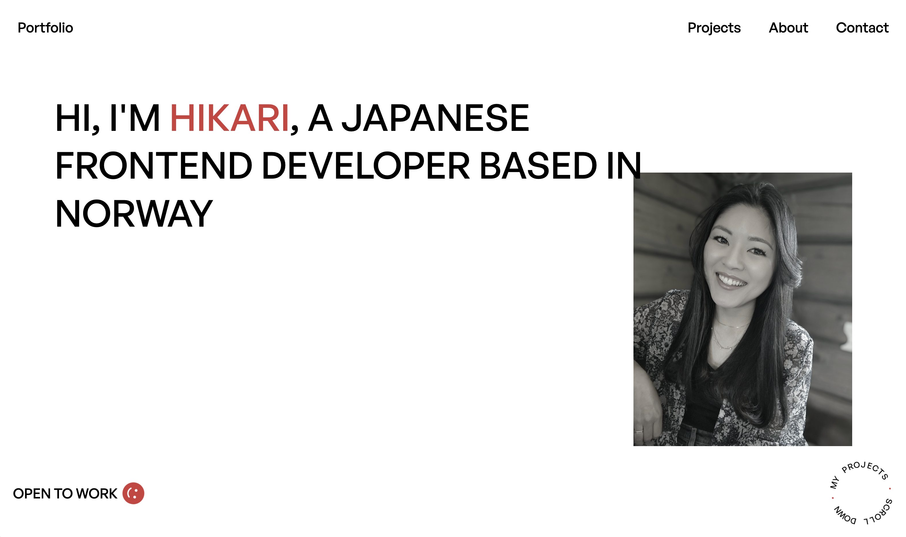

# Portfolio



## Description

This is my portfolio site.

## Built with

- HTML
- CSS
- JavaScript

## Getting Started

1. Clone the repo:

```bash
git clone https://github.com/H-chai/Portfolio.git
```

2. Install the dependencies:

```
npm install
```

### Running

To run the app, run the following commands:

```bash
npm run start
```

## Contact

Feel free to contact me

[My Linkedin Page](https://www.linkedin.com/in/hikari-%C3%B8verby-957493241)
